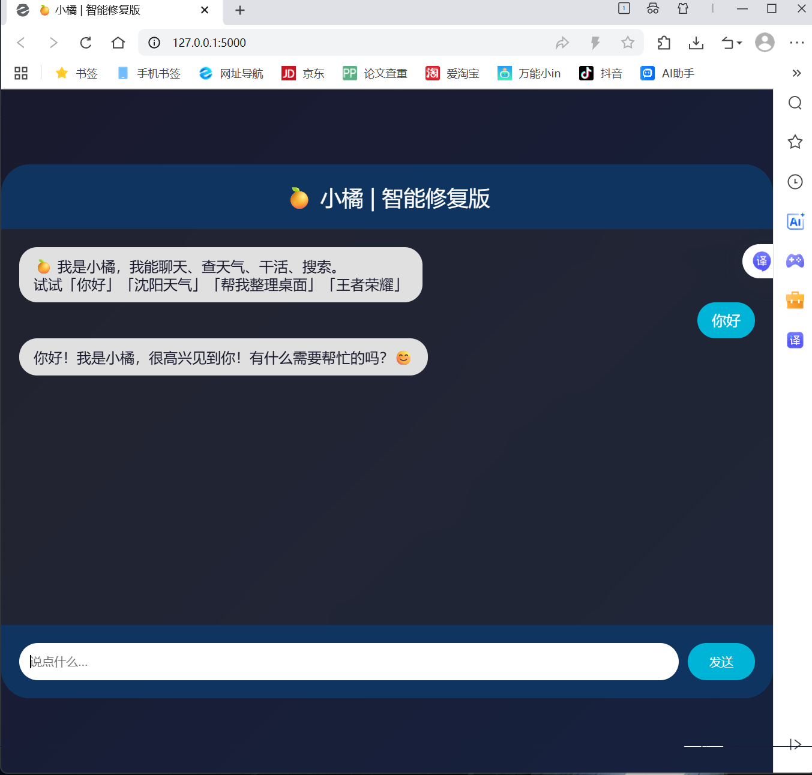

# 🍊 小橘 - 你的个人AI智能体

小橘是一个能听懂大白话、帮你干活、查天气、还能陪你聊天的 AI 助手。

## 功能

| 你说 | 小橘做 |
| --- | --- |
| 帮我整理桌面 | ✅ 按类型移动文件 |
| 沈阳天气 | ✅ 实时天气 |
| 我有点累 | ✅ 陪你聊天 |
| 下载文件夹太乱了 | ✅ 自动归类 |
## 界面截图

## 快速开始

1. 安装 Python 3.10+
2. 安装依赖：`pip install flask openai requests`
3. 获取 DeepSeek API Key
4. 运行 `python my_agent.py`
5. 访问 `http://127.0.0.1:5000`

## 技术栈

- Python + Flask
- OpenAI API（DeepSeek）
- HTML/CSS/JS

## 协议

MIT

## 作者

xkkky123
